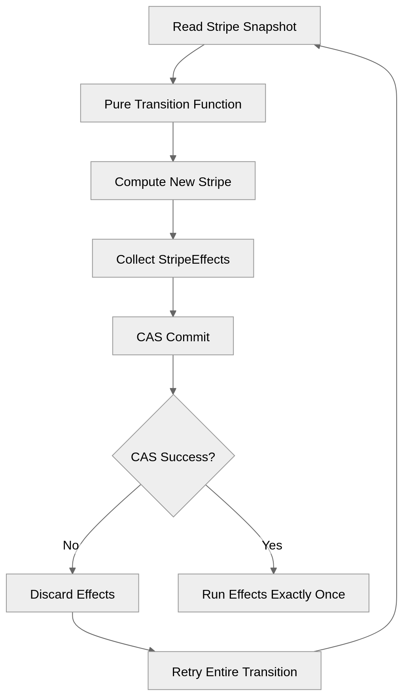
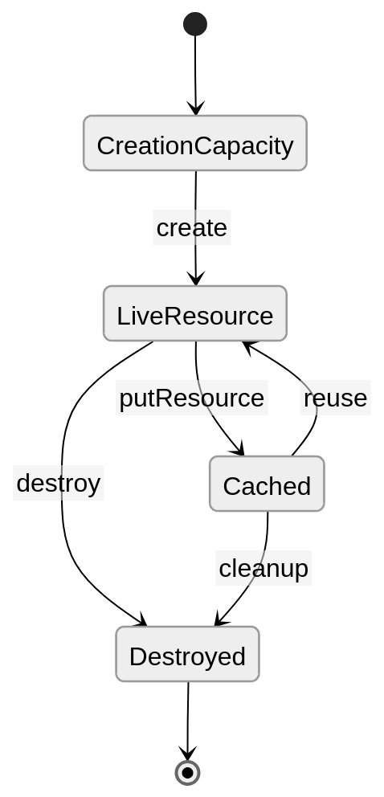
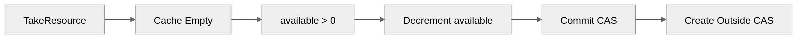
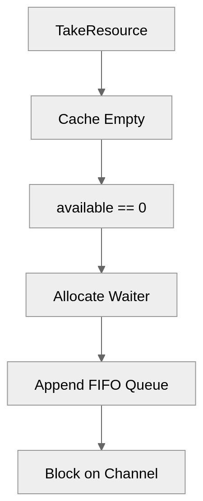
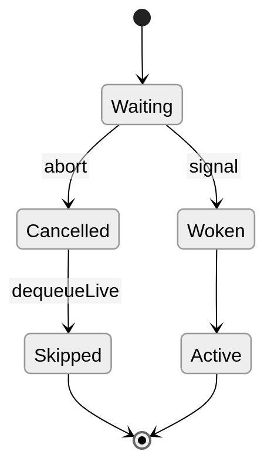
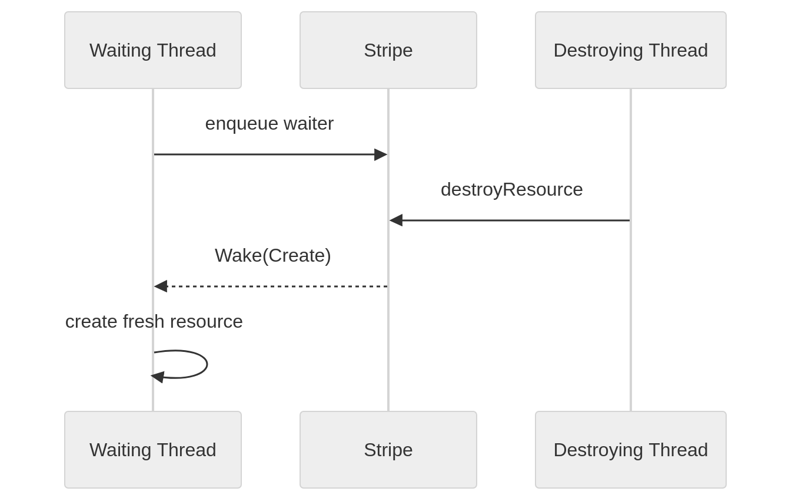
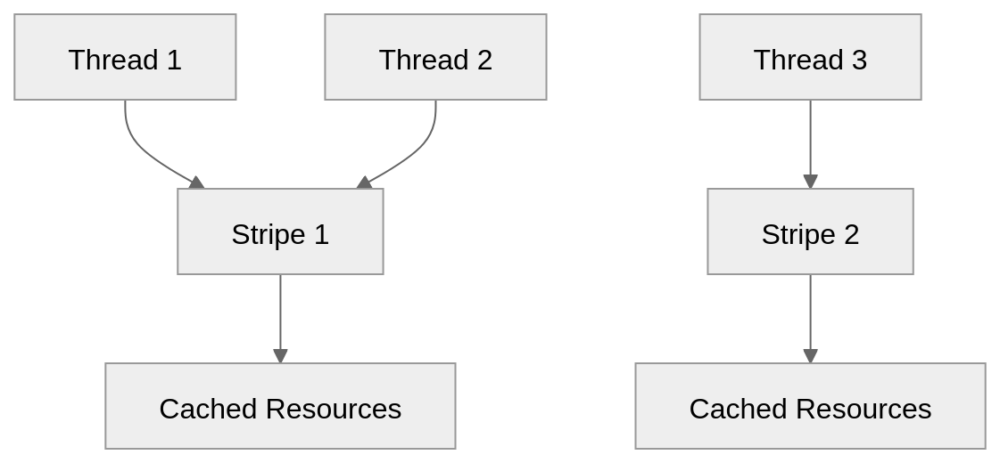

# A high-performance striped resource pooling implementation

This library implements a lock-free striped resource allocator whose entire concurrency model is encoded as a pure [compare-and-swap](https://en.wikipedia.org/wiki/Compare-and-swap) (CAS) driven state machine (via the [idris2-ref1](https://github.com/stefan-hoeck/idris2-ref1) library) over immutable `Stripe` values.

#### Note

The internals of this library heavily utilize the [idris2-ref1](https://github.com/stefan-hoeck/idris2-ref1) and [idris2-elin](https://github.com/stefan-hoeck/idris2-elin) libraries, so you may want to familiarize yourself with these two first.

## Model

At runtime, the system looks like this:

```
Pool ├── Stripe 0  (independent CAS machine)
     ├── Stripe 1  (independent CAS machine)
     ├── Stripe 2  (independent CAS machine)
     └── Stripe N
```

Each stripe owns:
- Creation capacity
- Cached resources
- Waiter queues
- Cancellation tombstones


This ensures that threads never directly mutate shared structures, they instead:
1.  Read immutable stripe state.
2.  Compute a new immutable stripe.
3.  CAS the old stripe, and replace with new stripe.
4.  Execute deferred effects after commit.

All concurrent mutation is reduced to atomic replacement of immutable Stripe snapshots.

## Stripe as a State Machine

This type is the heart of the library:

```
data Stripe a where
  MkStripe :  (available : Nat)
           -> (cache : List (Entry a))
           -> (queue : Queue (Waiter a))
           -> (queuer : Queue (Waiter a))
           -> (nextid : Nat)
           -> (cancelled : SortedSet Nat)
           -> Stripe a
```

`Stripe a` is the **complete** concurrent state, no hidden mutable structures exist outside of this type.

### Benefits

Most pool libraries spread state across the following:

-   Semaphores
-   Queues
-   Thread state
-   Mutable counters
-   Exception handlers
-   Background threads

This implementation instead centralizes everything into `Stripe a`, which makes the concurrency semantics **explicit** and **deterministic**. This is much closer to a distributed systems state machines or a lock-free runtime design than Haskell's [resource-pool](https://hackage.haskell.org/package/resource-pool) library.

## CAS Transition Model

Every operation can be boiled down to the following:

```
Stripe a -> StripeStep a
```

Where `StripeStep a` is defined as:

```
record StripeStep a where
  constructor MkStripeStep
  stripe  : Stripe a
  effects : List (StripeEffect a)
```

This separation is extremely important, as it enforces the boundary between CAS state machine transitions, and effects, which therefore prevents:
-   Duplicated wakeups, frees and inserts
-   Lost resources
-   Retry corruption

Below summarizes the general CAS transistion model flow:

```
Pure Transition
    ↓
CAS Commit
    ↓
Run Deferred Effects
```

## Deferred Effects

Suppose wakeups occurred inside CAS evaluation.

Then CAS retry could produce:

```
Wake waiterCAS failsRetryWake waiter again
```

This would catastrophically violate ownership, which this design avoids this completely (effects only occur after successful commit).

## Visual CAS Pipeline



## Tracking Effects

The following type is effectively an effect log:

```
data StripeEffect a  
= Wake ...
| InsertWithTimestamp a
| FreeMany ...
| None
```

The CAS transition computes **state mutation** as well as **side-effect intent** (neither are performed until commit succeeds).

## Resource Lifecycle

Below is a diagram illustrating the lifecycle of a resource



## Capacity Accounting

This library tracks available creation slots, which means the following invariant always holds true:

```
live_resources + available == stripe_capacity
```

## Fast Path

When the cache contains resources, there are no allocations, waiting or wakeups, only CAS.


## Slow Path

Creation is expensive and cancellable, therefor we reserve capacity atomically, create outside CAS, and restore capacity on failure.



## Wait Path

When the cache is exhausted



## FIFO Queue Design

This library uses a two-list queue variant, `queue` and `queuer`, found in `Stripe a`:
- `queue`  <-> front
- `queuer` <-> appended tail

In this model, `normalize` on `queue` and `queuer` produces the FIFO ordering.

## Cancellation Model

Instead of mutating waiter nodes, the `cancelled` field (which is a `SortedSet Nat`) of `Stripe a` stores tombstones, which means:

-  Waiters remain immutable.
-  Queue structure remains immutable.
-  Cancellation becomes monotonic state.

## Cancellation State Machine



### Notes

-   Cancellation does not remove queue nodes immediately.
-   Cleanup occurs lazily during dequeue.

### Why lazy cancellation matters

Correctness is much simpler due to avoiding immediate removal, instead we have immutable queues, tombstones, and lazy skipping.

### Core Cancellation Algorithm

`dequeueLive` is the core cancellation algorithm, as it:
1. Pop queue head  
2. Check tombstone set  
3. If cancelled:  
   1. remove tombstone  
   2. continue  
4. Otherwise:  
   1. return waiter

## Wake/Create Duality

This library provides clear semantics around waiters, since `WakeResult a` is one of `Deliver a`, `Create`, or `Cancelled`, not just `Maybe a`.

### Why Create Exists

Suppose that a resource is destroyed while a waiter exists, we have the ability to transfer creation permission directly to the waiter, instead of just restoring capacity.  This helps avoid races, unfair re-acquisition, and unnecessary queue churn.

### Wake/Create Handoff



## Stripe Locality

The pool that this library exposes is _explicitly_ striped, locality-aware, and thread-affine, because each thread hashes to `threadId mod stripeCount`.  This means that a given resource tends to remain on the same stripe, the reuse becomes localized, which leads to low contention.

The following diagram illustrates how locality emerges naturally as a consequence of the internals of the a `Stripe a`:



## Opportunistic Cleanup

Unlike Haskell's `resource-pool`, this library does not employ reaper threads, timer managers, or global cleanup loops.  Instead, cleanup occurs during normal operations via `cleanStripeIfNeeded`. This naturally makes cleanup deterministic, localized, and contention-friendly.  The tradeoff with this design is that idle stripes retain stale entries longer, which is often acceptable.

## Comparison to Haskell's resource-pool

| Feature              | Haskell's resource-pool   | idris2-resource-pool    |
| -------------------- | ------------------------- | ----------------------- |
| Concurrency Core     | STM                       | CAS state machine       |
| State Representation | Distributed state machine | Single immutable stripe |
| Wakeups              | Implicit                  | Explicit effects        |
| Cancellation         | Exception-driven          | Tombstone model         |
| Fairness             | Runtime-dependent         | Queue-defined           |
| Cleanup              | Background thread         | Opportunistic           |
| Ownership            | Implicit                  | Explicit transitions    |
| Formal Reasoning     | Difficult                 | Easier                  |
| Retry Semantics      | Hidden                    | Explicit                |
| Side Effects         | Mixed with mutation       | Deferred post-CAS       |
